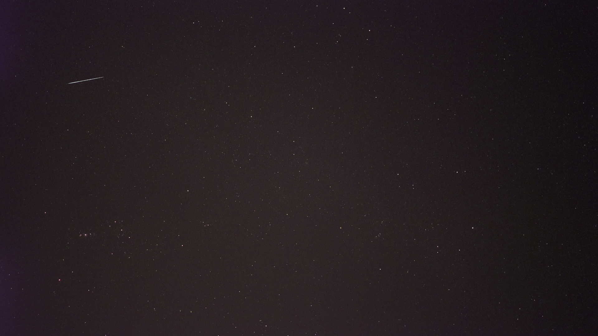

# MAD Midnight (Meteor Anomaly Detection) WebUI

The MAD Midnight WebUI is a state-of-the-art web application that uses two powerful machine learning models to provide real-time detection and classification of anomalies. The app can accurately identify objects as either meteors or other events, making it a valuable tool for researchers, scientists, and anyone else who requires precise anomaly detection.

Notably, the app is highly accessible and can be used remotely from anywhere in the world with an SSH connection to the server. This means that users can easily perform analyses and access results without being physically present at the server location.


# Installation
→ Install [Python3](https://www.python.org/downloads/release/python-3106/) (Version 3.8 - 3.10)

→ Download or use Git clone to download this project

### On Linux:
→ Open the Terminal, cd into the project folder
```
chmod +x webui.sh
./webui.sh
```

### On Windows:
```
double click the webui.bat 
```
→ A new tab with the MAD Midnight WebUI should open in your Internet Browser.
If not, then **ctrl** & **left-click** on the link provided in your Terminal or simply copy and paste it into your Internet Browser.


# Docker
Alternatively, you can use [Docker](https://docs.docker.com/get-docker/) to build and run the MAD Midnight WebUI. Follow these steps:

### Build the Docker image with the tag "madmidnight" by running in your Terminal:
```
docker build -t madmidnight .
```
## Run the Docker container with the madmidnight image, including a volume, by running:
```
docker run --gpus all -p 5000:5000 --rm madmidnight
```

# Output
As output we get both the individual images on which meteors appear and a summed image of all images of the same meteor which can be used for astrometry:


# TODO's:
- WebUI
    - [x] Startup Page with detection Parameters
    - [x] Upload Video
    - [x] Video Stream
    - [x] Show detected Meteors in Video Stream
    - [ ] Progress Bar during the Video Stream
    - [ ] End Application after the Video is finished
- Backend
    - [x] Trained and implemented single frame and sum frame object classifier 
    - [ ] Pipline for the sum frame is still not as in original and therefore not as accurate
    - [ ] Save Frames of Object as an uncompressed avi
    - [ ] Save xml for each detected Object
    - [ ] Calculate the time of object appearance
